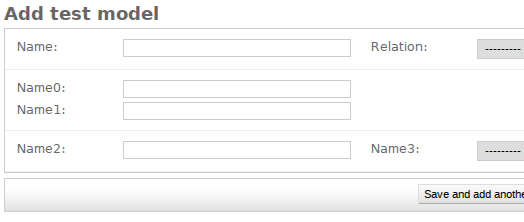

Runserver and go with chromium **and reduce the window width** so that the
input in the middle redisplays properly
http://localhost:8000/admin/test_app/testmodel/add/

To see this case

I know it's really minor but I'd really like to understand why the text inputs
redraw properly and why selects don't.

When reproduced cleanly in jsfiddle:

http://jsfiddle.net/jpic/ste4ku85/10/

you can see it resizes correctly:

Somehow related to
https://code.djangoproject.com/ticket/24784
(see git history ... for history)
